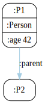

This is a .NET console application, written in F#, to convert RDF to the dot format of [GraphViz](https://www.graphviz.org/).

The following RDF triples in turtle format:

```ttl
    base <http://ex.org/>
    prefix : <http://ex.org/property/>

    <person/P1> a <class/Person> ;
        :age 42 ;
        :parent <person/P2> .
```

are converted to a dot file that renders as the following SVG:




To make compact visualizations, literal properties and type definitions are collapsed with their subject.

Base URI and namespace prefixes, either in the input file or passed as input options, help shorten resource names:

```bash
dotnet run rdf2dot "test.ttl" -base http://ex.org/ -ns :http://ex.org/property/ -ns class:http://ex.org/class/
```