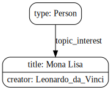

A simple RDF visualization tool based on [GraphViz](https://www.graphviz.org/).

The following RDF triples in turtle format:

```ttl
BASE <http://example.org/>
PREFIX foaf: <http://xmlns.com/foaf/0.1/>
PREFIX dcterms: <http://purl.org/dc/terms/>
PREFIX wd: <http://www.wikidata.org/entity/>
 
<bob#me>
    a foaf:Person ;
    foaf:topic_interest wd:Q12418 .
  
wd:Q12418
    dcterms:title "Mona Lisa" ;
    dcterms:creator <http://dbpedia.org/resource/Leonardo_da_Vinci> .
```

are converted via the _dot_ format to the following SVG:




The default rules make compact visualizations (only the subjects of some triple become nodes). Custom visualization rules can be specified with [N3](https://w3c.github.io/N3/reports/20230703/) (see the [documentation](https://giacomociti.github.io/rdf2dot/overview/) for details).


Try it online [here](https://giacomociti.github.io/rdf2dot/).