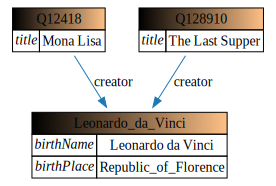

[](https://npm.im/rdf2dot)

A simple RDF visualization tool based on [GraphViz](https://www.graphviz.org/).

Diagram descriptions are derived with [N3](https://w3c.github.io/N3/reports/20230703/) rules and converted to [dot](https://www.graphviz.org/doc/info/lang.html) notation.

The default rules make compact visualizations (only the subjects of some triple become nodes):

```ttl
@prefix dcterms: <http://purl.org/dc/terms/> .
@prefix wd: <http://www.wikidata.org/entity/> .
@prefix dbo: <https://dbpedia.org/ontology/> .
@prefix dbpedia: <http://dbpedia.org/resource/> .
  
wd:Q12418
    dcterms:title "Mona Lisa" ;
    dcterms:creator dbpedia:Leonardo_da_Vinci .

wd:Q128910
    dcterms:title "The Last Supper" ;
    dcterms:creator dbpedia:Leonardo_da_Vinci .

dbpedia:Leonardo_da_Vinci
    dbo:birthName "Leonardo da Vinci" ;
    dbo:birthPlace dbpedia:Republic_of_Florence .
```




Visualization rules can be customized (see the [documentation](https://giacomociti.github.io/rdf2dot/doc/overview.html) for details).


Try it online [here](https://giacomociti.github.io/rdf2dot/).